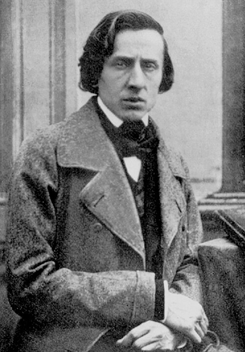

## Chopin, The master of romanticism

  

    
  

  

    Frédéric François Chopin (1810–1849) was not only one of the greatest composers of the Romantic period, but also the very essence of musical genius devoted entirely to the piano. Born on 1 March 1810 in Żelazowa Wola,      Poland, and dying prematurely in Paris on 17 October 1849, his life was as intense as it was short. Despite being marked by exile and illness, Chopin left behind an immense musical legacy. His catalogue consists of         around 113 compositions, masterpieces that redefined piano technique and expression, transforming waltzes, nocturnes and polonaises into timeless musical poems.
  

Unlike many of his contemporaries, who wrote large-scale works such as operas and symphonies, Frédéric Chopin chose to focus on short, highly expressive pieces, developing a musical vocabulary that defined the Romantic era.

### The Forms Chosen
His compositions can be broadly categorised as dances (such as Mazurkas and Waltzes), lyrical and narrative pieces (Nocturnes) and virtuosic educational works (Studies/Etudes and Preludes).

To fully understand the importance that Chopin attached to each form, it is useful to examine how he organised his work.

As the bar chart below shows, although forms such as nocturnes and waltzes are iconic, Chopin devoted an extraordinarily high number of compositions to short genres such as preludes and, in particular, études. For example, the bar chart clearly shows the large number of études. This data highlights the importance of technique and timbral exploration for the composer.

Moreover, the highest bar is labelled 'Compositions'. This category encompasses works that do not fall into a specific genre, such as occasional pieces, arrangements, early works and single pieces.

In his short but intense life, Fryderyk Chopin was much more than just a “composer”. As well as being universally recognised as one of the greatest piano composers, he was also a highly regarded teacher who devoted long hours to training his students, many of whom came from Parisian high society. His teaching was rigorous and innovative, emphasising sonority and personal expression.

He was also a pedagogue in the broadest sense, influencing generations of pianists through his teaching methods. His approach to technique and interpretation has left a lasting legacy that is still studied and practised today.

However, these are just some of the aspects of his work. For a more complete overview of his roles and activities, please refer to the diagram below.

If you would like to explore the distribution of Chopin's works in more detail and learn more about the quantitative data presented in this article, or if you would like to view the key locations in his life (from his native Żelazowa Wola to Warsaw, through to his long stay in Paris and his travels) using an interactive map, you can do so easily by [clicking here!](https://melody-data.github.io/stories/published_stories/story_1763395817.965354.html)

